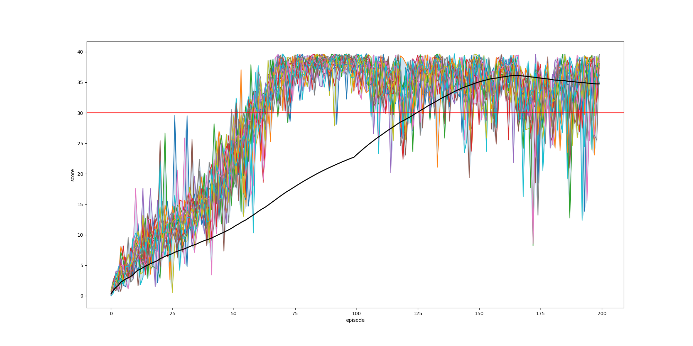

# Report

For the project, I have chosen to focus on solving **Option 2 of the task, which uses 20 parallel agent-environments** to learn a single policy. (Note that none of the algorithmic decisions are exclusive to the parallel agents setting, and the design should work for the single agent as well, but certain parameters may need to be tuned for success in the single agent training case - this is not explored in this report.)

## Learning Algorithm

The learning algorithm is based on Deep Deterministic Policy Gradients [[1]](#ddpg_paper). In pseudocode, the algorithm can be described:

```
Initialize actor_local and actor_target networks
Initialize critic_local and critic_target networks
Initialize replay buffer of BUFFER_SIZE

For each episode:
    Reset all parallel environments, observe the initial states
    While none of the parallel episodes have ended:

        For each parallel environment:
            Use the Actor network to select an action given the current state, perturb action with NOISE
            Execute the selected action in the environment
            Observe the reward and next_state returned by the environment
            Store (state, action, reward, next_state) tuple in the replay buffer

        If current episode is a multiple of LEARN_EVERY:
            Repeat UPDATES_PER_LEARN times:
                Sample BATCH_SIZE samples from the replay buffer
                Update critic_local:
                    
                    Use critic_target to predict Q_expected from states and actions
                    
                    Use actor_target to select next_actions from next_states
                    Use critic_target to predict Q_targets_next from next_states and next_actions
                    Calculate TD bootstrapped Q_targets = rewards + Q_targets_next

                    Calculate MSE loss between Q_expected and Q_targets
                    Update critic_local network with gradient descent on the loss

                Update actor_local:
                    Use actor_local to select actions from states
                    Use critic_local to predict returns from states and actions
                    Set loss = -returns; Using the negative returns as the loss so that we maximize returns when minimizing loss
                    Update actor_local network with gradient descent on the loss

                Soft update of critic_target towards critic_local, with TAU as the interpolation coefficient
                Soft update of actor_target towards actor_local, with TAU as the interpolation coefficient
```

For in-depth analysis and explanation of the DDPG and its design, please refer to [[1]](#ddpg_paper). The main important points to note:

- The algorithm follows an **Actor-Critic** method which uses an Actor network to select actions and a Critic network to predict the Q-value of state-action pairs. The algorithm can be thought of as a modification of Deep Q-Networks (DQN) in order to support continuous space actions.
- During exploration, the algorithm adds all experiences to a **replay buffer**. Learning happens periodically and off-policy by uniform random sampling from the buffer, which helps remove correlations in the observation sequence.
- Both the Actor and Critic have **local and target network versions**; the local networks are trained with gradient descent on their respective loss functions, whereas the target networks which are used to generate the loss targets are kept stable by performing soft updates (slowly interpolating towards the local network's weights)
- During training, **exploration is encouraged by adding noise** to predicted actions. As in the paper, we use an Ornstein-Uhlenbeck process to generate temporally correlated exploration noise.

#### Hyperparameters

```python
BUFFER_SIZE = int(1e6)  # replay buffer size
BATCH_SIZE = 128        # minibatch size
GAMMA = 0.99            # discount factor
TAU = 1e-3              # for soft update of target parameters
LR_ACTOR = 1e-3         # learning rate of the actor
LR_CRITIC = 1e-3        # learning rate of the critic
WEIGHT_DECAY = 0        # L2 weight decay
LEARN_EVERY = 20        # learn on every ?th step
UPDATES_PER_LEARN = 10  # perform ? updates per learn
EPSILON = 1.0           # explore->exploit noise process added to act step
EPSILON_DECAY = 1e-6    # decay rate for noise process
```

#### Network architecture

The Q-network has a simple architecture consisting of 2 fully-connected hidden layers between the input and output layers:
```
INPUT LAYER:        33 input state dimensions
HIDDEN LAYER 1:     Fully-connected layer of size 300
HIDDEN LAYER 2:     Fully-connected layer of size 200
OUTPUT LAYER:       4 output action dimensions
```
Between each layer, we apply a Rectified Linear Unit (ReLU). Additionally, we apply batch normalization on the output of the first hidden layer.

For the most part, the hyperparameters and network architecture follow those described in the DDPG paper [[1]](#ddpg_paper), and turned out to be sufficient to solve this environment.

## Results

The agent successfully solves the environment after 126 episodes, where the moving average (over a 100-episode window) crosses the target of +30.



_The plot above shows the training progress over 200 episodes, reaching the solved criteria at episode 126 and hitting a max plateau of score = 40. The colored plots show the return of each 20 agents for each episode; the black plot is the average score of all 20 agents over a moving average window of 100 episodes (at <100 episodes, the moving average is taken from episode 0 to the current episode); the red line indicates the threshold +30 where the environment is considered solved._

The following gif shows the final policy's successful performance on the task, after completing all 200 training episodes:


## Future Work
Many possible improvements could be made to the algorithm.

#### Hyperparameter tuning
The current solution was chosen mostly following the DDPG paper implementation. It is likely that by running a large scale hyperparameter search (including model architecture search), it will be possible to improve the results for this particular environment.

#### Algorithm extensions

This solution implements the DDPG algorithm based on [[1]](#ddpg_paper). However, there are many other algorithms which could also be used to solve the same environment, and would be worth evaluating in an extension of this work. To name a few, promising works include:
- Trust Region Policy Optimization (TRPO) [[2]](#trpo_paper)
- Proximal Policy Optimization (PPO) [[3]](#ppo_paper)
- Distributed Distributional Deterministic Policy Gradients (D4PG) [[4]](#d4pg_paper)

## References
- <a name="ddpg_paper">[1]</a> Lillicrap, Timothy P., et al. "Continuous control with deep reinforcement learning." arXiv preprint arXiv:1509.02971 (2015).
- <a name="trpo_paper">[2]</a> Schulman, John, et al. "Trust region policy optimization." International conference on machine learning. 2015.
- <a name="ppo_paper">[3]</a> Schulman, John, et al. "Proximal policy optimization algorithms." arXiv preprint arXiv:1707.06347 (2017).
- <a name="d4pg_paper">[4]</a> Barth-Maron, Gabriel, et al. "Distributed distributional deterministic policy gradients." arXiv preprint arXiv:1804.08617 (2018).